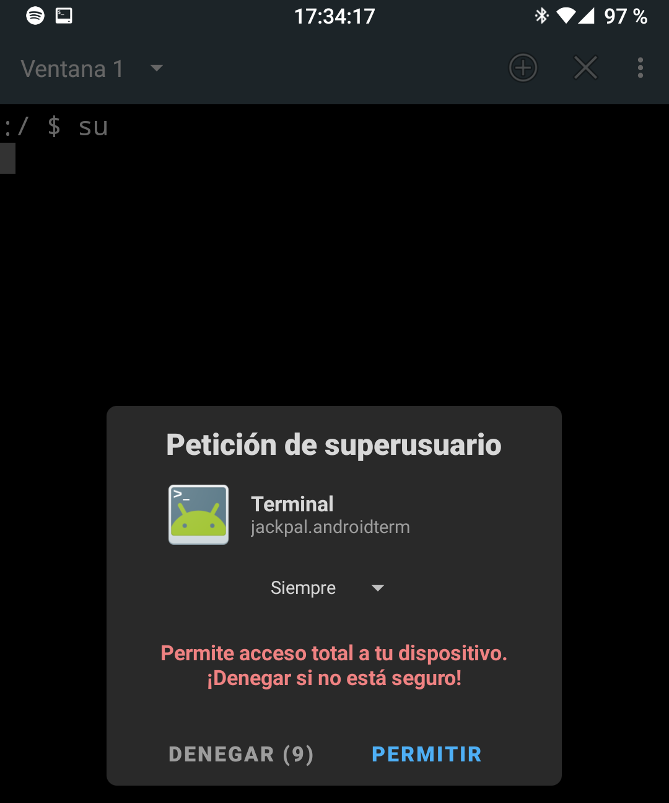

# <div align="center"> Incremental volume in Android <p align="center"> </p>

A continuación se mostrarar como agregar más niveles de volumen en el sistema Android. 

Esta prueba fue realizada en un Google Pixel 1 con Lineage OS. 
  
Debido a unos cambios en el sistema Android en las nuevas versiones, no se puede realizar como antiguamente cambiando los valores directamente en build.prop, si no que es necesario el complemento de Magisk Manager "MagiskHide Props Config" para poder modificar el archivo build.prop.
  
Requisitos:
* Dispositivo rooteado
* <a href="https://github.com/topjohnwu/Magisk" target="_blank">Magisk Manager</a> instalado. (Administrador de root)
* <a href="https://play.google.com/store/apps/details?id=jackpal.androidterm" target="_blank">Terminal Emulator for Android</a> Instalado. (Puede ser otra terminal) 
* <a href="https://github.com/Magisk-Modules-Repo/MagiskHidePropsConf" target="_blank">MagiskHide Props Config</a> instalado. (Complemento de Magisk Manager)
  
## Pasos ##
* Paso 1: Abrir Terminal Emulator for Android y escribir lo siguiente:
```bash
su
```
Luego de presionar enter aparece la siguiente ventana preguntandonos si queremos darle permiso a la consola como root. Presionamos en "permitir".

